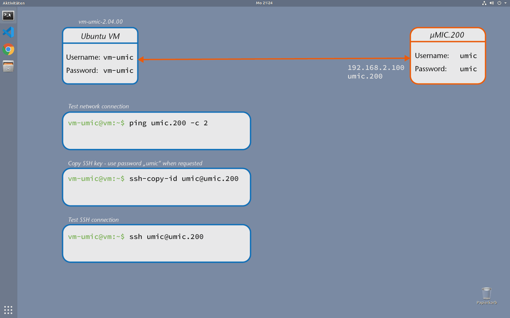
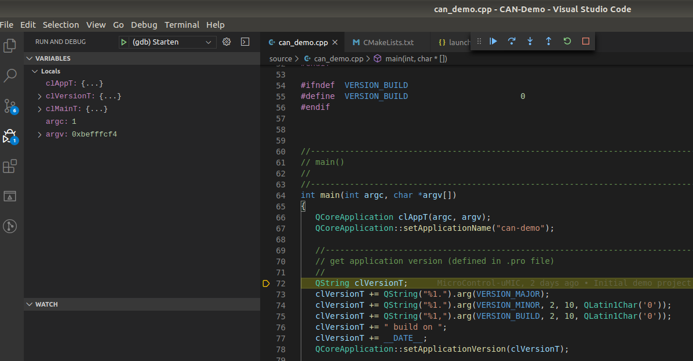

# **CAN** Example

This code provides an example for access to the CAN bus. The program sends two CAN messages
on CAN interface *CAN1* and waits 10 seconds before it quits. CAN messages received by interface
*CAN1* are printed to the console.

In order to start the demo use the following command:

```
./can-demo 
```

## Prerequisites

The project is prepared for the µMIC.200 controller and can be compiled either directly on the controller or within the development virtual machine.

Just download the µMIC.200 [Development Virtual Machine](https://www.microcontrol.net/download/software/umic/vm-umic-2.04.00.ova) and start the development.

## How to build

Open the project inside Visual Studio Code and select `CMake: Build Target`
from the Command Palette (`STRG + Shift + P`). As alternative you can press
`Shift + F7`. 



## How to run

Copy the program to the µMIC.200 controller by selecting `Terminal -> Run Task...`
from the menu. Start the download by selecting `Copy program`. Open the terminal
view in Visual Studio Code (`CTRL + Shift + ´`) and connect to the µMIC.200
controller.

```
ssh umic@umic.200
./can-demo can1
```


## How to debug

Open the terminal view in Visual Studio Code (`CTRL + Shift + ´`) and connect to the µMIC.200
controller. Start the GDB server on the µMIC.200 controller.

```
ssh umic@umic.200
gdbserver :2345 ./can-demo
```


Select `Debug -> Start Debugging` from the menu or press `F5`. The debugger will start and
set a breakpoint at the first code line of the program.


